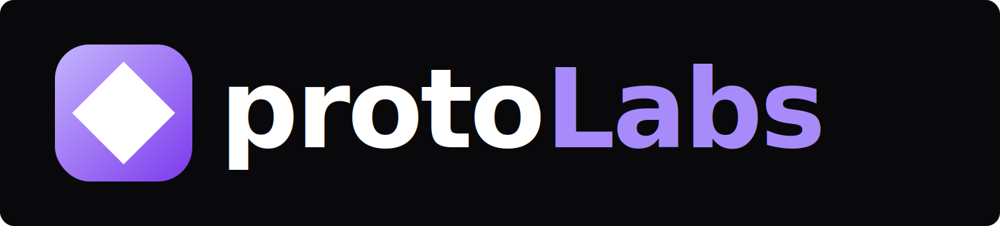

<p align="center">
  
</p>

<p align="center">
  <strong>Your team of AI agents. Your codebase. Fully autonomous.</strong><br/>
  Describe what you want built. Named agents implement it, create PRs, and ship — while you hold the merge button.
</p>

<p align="center">
  <a href="https://github.com/protoLabsAI/protolabs-studio/actions/workflows/test.yml"></a>
  <a href="LICENSE"></a>
  <a href="https://discord.gg/protolabs"></a>
  <a href="https://nodejs.org/"></a>
  <a href="https://protolabs.studio"></a>
</p>

> **Alpha Software** --- protoLabs Studio is under active development. APIs change, rough edges exist. If you want to shape the future of autonomous development, you're in the right place.

---

## The Idea

Most AI coding tools give you a single agent in a single file. protoLabs gives you a **team**.

Specialized agents — frontend, backend, infrastructure, DevOps — each with domain expertise, memory, and their own isolated workspace. They read your codebase, follow your coding standards, and produce real PRs against real branches.

You describe features on a Kanban board. Agents pick them up, implement them in isolated git worktrees, run verification, and create pull requests. CodeRabbit reviews the code. CI runs the tests. You merge when ready.

No copy-pasting prompts. No babysitting context windows. You set the rules once in context files, and every agent follows them every time.


## Get Started

_Desktop releases coming soon. Run from source to try now._

### Run from Source

```bash
git clone https://github.com/protoLabsAI/protolabs-studio.git
cd protolabs-studio
npm install
npm run dev                 # Interactive launcher (choose web or electron)
npm run dev:full            # Web mode — starts UI (localhost:3007) AND server (localhost:3008)
npm run dev:electron        # Desktop app mode (bundles server automatically)
```

Requires **Node.js 22+** and an [Anthropic API key](https://console.anthropic.com/).

## What Makes It Different

### Named Agent Teams

Not "Agent 1" and "Agent 2" --- real personas with domain expertise. Matt handles React, Tailwind, and component architecture. Kai builds Express routes, services, and API design. Frank manages Docker, CI, and infrastructure. Each agent accumulates memory from prior work, getting better at your codebase over time.

### Worktree Isolation

Every feature runs in its own git worktree. Three agents working simultaneously on different features --- zero conflicts. Each produces a clean, reviewable PR from an isolated branch. Main stays untouched until you merge.

### Context Files = Your Rules

Drop coding standards, architectural patterns, and project conventions into `.automaker/context/`. Every agent loads them before writing a single line. Your team, your rules --- enforced automatically across every agent session.

### Auto-Mode

Queue features with dependencies. Auto-mode resolves execution order and runs agents in parallel where possible. A 10-feature project with a dependency chain (DB schema -> API routes -> frontend) executes in the right order, maximizing throughput.

### Real-Time Streaming

Watch agents think and code in real time. Send instructions mid-flight --- "also add TypeScript types" or "use Tailwind instead" --- and agents adjust without starting over.

### Full Project Orchestration

For larger work: describe an idea, get a SPARC PRD, break it into milestones with sized phases, generate board features with dependencies, and launch. Research -> plan -> execute -> review -> merge -> done.

### Claude Code Plugin

159 MCP tools for full control from your terminal. Manage boards, start agents, set dependencies, review output --- without leaving Claude Code.

```
/board              View and manage your Kanban board
/auto-mode          Start/stop autonomous feature processing
/orchestrate        Manage feature dependencies
/plan-project       Full project lifecycle pipeline
/ava                Autonomous operator mode
```

## How It Works

```
You describe a feature --> Agent claims it --> Works in isolated worktree --> Creates PR --> You review & merge
```

1. Add a feature to the board with a natural language description
2. Auto-mode assigns the right agent based on domain and complexity
3. Agent works in a git worktree --- reads codebase, implements, runs verification
4. PR created with full diff, agent output, and CI checks
5. CodeRabbit reviews. CI passes. You merge. Feature moves to done.

For complex projects, protoLabs runs a full pipeline: idea -> codebase research -> SPARC PRD -> human review -> milestones -> parallel agent execution -> PR review -> ship.

## Trust Architecture

Autonomous agents writing code sounds risky. It is --- if you skip the discipline.

protoLabs works because the guardrails are non-negotiable:

- **Context files define the rules.** Your coding standards, architectural decisions, and conventions are injected into every agent session. Agents follow your rules because you wrote them.
- **CodeRabbit reviews every PR.** Automated code review catches style violations, security issues, and logic errors before any human sees the diff.
- **CI runs on every push.** TypeScript, linting, formatting, tests --- nothing merges without passing.
- **You hold the merge button.** Agents create PRs. They do not push to production. Every change goes through your normal review process.
- **Model tiering matches cost to complexity.** Haiku for formatting fixes. Sonnet for standard features. Opus for architecture. Auto-escalation after failures.

Trust is earned, not assumed. You control the context files agents read, the review gates they pass through, and the branches they can touch.

## Architecture

TypeScript monorepo with a React frontend, Express backend, and 15 shared packages:

```
protolabs-studio/
├── apps/
│   ├── ui/              # React + Vite + Electron (port 3007)
│   └── server/          # Express + WebSocket backend (port 3008)
├── libs/                # 15 shared packages (@protolabsai/*)
│   ├── types/           # Core TypeScript definitions
│   ├── utils/           # Logging, errors, context loading
│   ├── git-utils/       # Git operations & worktree management
│   ├── observability/   # Langfuse tracing & cost tracking
│   ├── tools/           # Unified tool definition & registry
│   ├── flows/           # LangGraph state graph primitives
│   ├── prompts/         # AI prompt templates
│   └── ...              # platform, model-resolver, dependency-resolver, etc.
├── packages/
│   └── mcp-server/      # Claude Code plugin (159 MCP tools)
└── site/                # Landing page (protolabs.studio)
```

**Key Stack**: React 19, Vite 7, Electron 39, Express 5, Claude Agent SDK, TanStack Router, Zustand 5, Tailwind CSS 4, Langfuse, Playwright, Vitest

## Documentation

Full docs at **[protolabs.studio](https://protolabs.studio)**:

- **[Getting Started](docs/getting-started/)** --- Installation, configuration, first feature
- **[Agent System](docs/agents/)** --- How agents work, teams, prompt engineering
- **[Self-Hosting](docs/infra/)** --- Docker, systemd, staging deployment
- **[Integrations](docs/integrations/)** --- Discord, Claude Code plugin, MCP tools
- **[Development](docs/dev/)** --- Contributing, architecture, shared packages

## Community

Join builders exploring agentic coding and autonomous development:

**[Discord](https://discord.gg/protolabs)** · **[protolabs.studio](https://protolabs.studio)** · **[GitHub](https://github.com/protoLabsAI)** · **[Code of Conduct](CODE_OF_CONDUCT.md)**

## Contributing

protoLabs uses an **ideas-only contribution model** --- AI agents implement all code.

- **Submit an idea**: [Idea Submission](https://github.com/protoLabsAI/protoMaker/issues/new?template=idea_submission.yml)
- **Report a bug**: [Bug Report](https://github.com/protoLabsAI/protoMaker/issues/new?template=bug_report.yml)
- **Join the discussion**: [Discord](https://discord.gg/protolabs)

[Contributing Guidelines](CONTRIBUTING.md)

## Security

This software uses AI agents that access your file system and execute commands. We recommend running in Docker or a VM for isolation. See the [full disclaimer](docs/disclaimer.md).

## License

MIT --- see [LICENSE](LICENSE).

Originally forked from [Automaker](https://github.com/AutoMaker-Org/automaker) (MIT). We are the actively maintained successor.

---

<p align="center">
  Built by <a href="https://protolabs.studio">protoLabs</a> --- an AI-native development agency.
</p>
