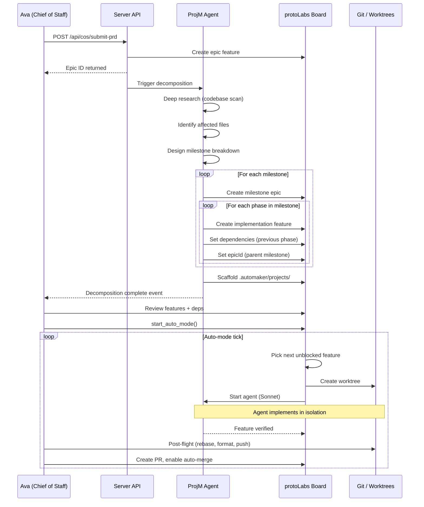

# Agent Flows

End-to-end pipeline diagrams documenting how work moves through protoLabs's autonomous development system.

## protoLabs Dev Cycle — Idea to Merged PR

The complete lifecycle from an idea entering the system through to code merged on main. This is the core pipeline that protoLabs automates.

### Full Pipeline Diagram

```mermaid
flowchart TD
    subgraph Intake["1. Intake"]
        A[Idea / Signal] --> B{Source?}
        B -->|Human| C[Josh creates PRD via CLI]
        B -->|CoS| D["Ava submits PRD via submit_prd MCP"]
        B -->|External| E[GitHub issue / Discord signal]
        C --> F[SPARC PRD Document]
        D --> F
        E --> F
    end

    subgraph Planning["2. Planning & Decomposition"]
        F --> G[ProjM Agent receives PRD]
        G --> H[Deep research — codebase scan]
        H --> I[Decompose into milestones + phases]
        I --> J["Scaffold .automaker/projects/"]
        J --> K["create_project_features()"]
        K --> L[Epic features per milestone]
        K --> M[Implementation features per phase]
        K --> N[Dependency chain set]
    end

    subgraph Execution["3. Autonomous Execution"]
        N --> O{Auto-mode running?}
        O -->|No| P["start_auto_mode(concurrency=1)"]
        O -->|Yes| Q[Tick loop]
        P --> Q
        Q --> R[Load pending features]
        R --> S[Topological sort by dependencies]
        S --> T[Filter: deps satisfied + not blocked]
        T --> U[Pick highest priority unblocked feature]
        U --> V[Create git worktree]
        V --> W["Agent starts (Sonnet default)"]
    end

    subgraph AgentWork["4. Agent Implementation"]
        W --> X[Read feature description + context files]
        X --> Y[Ava sends context message]
        Y --> Z[Agent implements in worktree]
        Z --> AA[Agent runs tests]
        AA --> AB{Tests pass?}
        AB -->|Yes| AC[Agent marks verified]
        AB -->|No| AD[Agent iterates / fixes]
        AD --> Z
        AC --> AE{Hit turn limit?}
        AE -->|No| AF[Clean completion]
        AE -->|Yes| AG[Partial work in worktree]
    end

    subgraph PostFlight["5. Post-Flight PR Pipeline"]
        AF --> AH[Ava: Check worktree commits]
        AG --> AH
        AH --> AI[Rebase on origin/main]
        AI --> AJ[Prettier format fix]
        AJ --> AK[Push branch to origin]
        AK --> AL["gh pr create"]
        AL --> AM["gh pr merge --auto --squash"]
        AM --> AN[Move feature to review]
    end

    subgraph CIReview["6. CI & Review"]
        AN --> AO[GitHub Actions CI]
        AO --> AP{All checks pass?}
        AP -->|build| AQ[TypeScript build]
        AP -->|test| AR[Vitest unit tests]
        AP -->|format| AS[Prettier check]
        AP -->|audit| AT[Security audit]
        AP -->|e2e| AU[Playwright E2E]
        AQ & AR & AS & AT & AU --> AV{CodeRabbit review}
        AV --> AW{Critical threads?}
        AW -->|Yes| AX["Resolve threads (GraphQL mutation)"]
        AW -->|No| AY[All clear]
        AX --> AY
    end

    subgraph Completion["7. Merge & Completion"]
        AY --> AZ[Auto-merge executes]
        AZ --> BA[PR squash-merged to main]
        BA --> BB[Move feature to done]
        BB --> BC{All epic children done?}
        BC -->|Yes| BD[Close epic]
        BC -->|No| BE[Continue with next feature]
        BD --> BF{All epics in milestone done?}
        BE --> Q
        BF -->|Yes| BG[Milestone retro ceremony]
        BF -->|No| BE
        BG --> BH{More milestones?}
        BH -->|Yes| BE
        BH -->|No| BI[Project complete]
    end

    subgraph Escalation["Recovery & Escalation"]
        AP -->|Failure| BJ[CI failure detected]
        BJ --> BK{Fixable?}
        BK -->|Format| AJ
        BK -->|Build error| BL[Escalate complexity]
        BL --> BM["Retry: haiku→sonnet→opus"]
        BM --> W
        BK -->|Blocked| BN[Create blocking issue]
        BN --> BO[Alert via EscalationRouter]
    end

    style Intake fill:#1e293b,color:#e2e8f0
    style Planning fill:#1e3a5f,color:#e2e8f0
    style Execution fill:#1a3a2a,color:#e2e8f0
    style AgentWork fill:#3a2a1a,color:#e2e8f0
    style PostFlight fill:#2a1a3a,color:#e2e8f0
    style CIReview fill:#3a1a1a,color:#e2e8f0
    style Completion fill:#1a2a3a,color:#e2e8f0
    style Escalation fill:#4a1a1a,color:#e2e8f0
```

### ProjM Decomposition Flow (Detail)

The Project Manager agent's internal flow when receiving a PRD from the Chief of Staff.

### Key Metrics

| Metric                              | Typical Value         |
| ----------------------------------- | --------------------- |
| Agent implementation time           | 3-6 min (Sonnet)      |
| PR pipeline (post-flight → merge)   | 2-5 min               |
| Full feature cycle (backlog → done) | 8-15 min              |
| Agent cost per feature              | $1.15-1.70 (Sonnet)   |
| Escalation rate                     | ~15% (format fixes)   |
| Auto-merge success rate             | >95% after format fix |

## Instance State & Onboarding

All flows above operate within a single protoLabs instance. Each instance starts with a **clean operational slate** — no inherited board, no stale task queue.

### What's Shared vs Instance-Local

| Layer              | Examples                                               | Scope          |
| ------------------ | ------------------------------------------------------ | -------------- |
| **Shared (git)**   | `.automaker/context/`, `memory/`, `skills/`, `spec.md` | All instances  |
| **Instance-local** | `.automaker/features/`, `projects/`                    | Single machine |

Knowledge compounds across all instances via git. Operations are ephemeral by design — when a new VM spins up, it runs setupLab to build context from research rather than inheriting another machine's state.

### Why This Matters for Flows

- **Planning flow** (ProjM decomposition) creates project plans in `.automaker/projects/` — instance-local, not committed to git
- **Execution flow** (auto-mode) manages board state in `.automaker/features/` — instance-local
- **Learning flow** (agent memory) writes to `.automaker/memory/` — git-tracked, shared across instances
- **Onboarding flow** (setupLab) scans a repo, analyzes gaps, and initializes `.automaker/` — builds understanding from scratch

This architecture is the foundation for [Hivemind](../dev/instance-state.md#hivemind-multi-instance-mesh), where multiple instances form a domain-scoped mesh, each owning a slice of the codebase.

See [Instance State Architecture](../dev/instance-state.md) for the full design.
