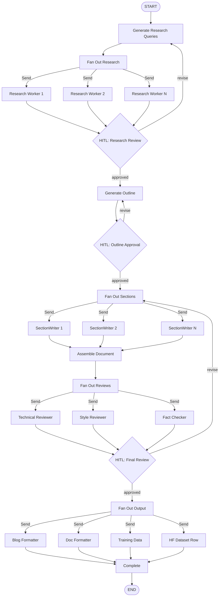

# Flows Package

`@protolabsai/flows` provides LangGraph state graph primitives for building multi-agent coordination flows. It includes state management utilities, typed reducers, routing helpers, a graph builder, and reference implementations of common patterns.

**Owner:** Infrastructure agent (agent infra domain)

## Package Structure

```
libs/flows/src/
├── graphs/                         # Core primitives
│   ├── state-utils.ts              # Zod-to-Annotation bridging
│   ├── reducers.ts                 # Built-in state reducers
│   ├── routing.ts                  # Conditional edge routers
│   ├── builder.ts                  # GraphBuilder class + helpers
│   ├── research-flow.ts            # Reference: linear research flow
│   ├── review-flow.ts              # Reference: human-in-the-loop review
│   ├── coordinator-flow.ts         # Reference: Send() fan-out coordinator
│   ├── nodes/                      # Reference node implementations
│   ├── subgraphs/                  # Reference subgraph implementations
│   └── utils/
│       └── subgraph-wrapper.ts     # Subgraph isolation utility
├── antagonistic-review/            # Dual-perspective PRD review
│   ├── state.ts                    # AntagonisticReviewStateAnnotation
│   ├── graph.ts                    # Graph with type bridge adapters
│   └── nodes/                      # Classify, pair-review, consensus, HITL
├── project-planning/               # Project planning flow
│   ├── types.ts                    # ProjectPlanningStateAnnotation
│   ├── graph.ts                    # Graph with 4 HITL checkpoints
│   ├── nodes/                      # Research, PRD, milestones, HITL, issues
│   └── executors/                  # LLM executor implementations
├── content/                        # Content creation pipeline
│   ├── content-creation-flow.ts    # Main 6-phase content pipeline
│   ├── state.ts                    # ContentStateAnnotation
│   ├── types.ts                    # Zod schemas: BlogPost, TechDoc, etc.
│   ├── prompt-loader.ts            # Handlebars prompt compilation
│   ├── prompts/                    # .md prompt templates
│   ├── nodes/                      # Outline, generation, review nodes
│   └── subgraphs/                  # Research, section writer, review
└── index.ts
```

## Core Concepts

### State Annotations

LangGraph uses `Annotation.Root()` to define typed state. This package bridges Zod schemas to LangGraph annotations:

```typescript
import { createStateAnnotation, validateState } from '@protolabsai/flows';
import { z } from 'zod';

const schema = z.object({
  query: z.string(),
  results: z.array(z.string()),
  count: z.number(),
});

// Bridge Zod → LangGraph Annotation with custom reducers
const MyState = createStateAnnotation(schema, {
  results: (left, right) => [...left, ...right], // append reducer
  count: (left, right) => left + right, // counter reducer
});
```

Or define annotations directly (preferred for complex state):

```typescript
import { Annotation } from '@langchain/langgraph';

const MyState = Annotation.Root({
  task: Annotation<string>,
  results: Annotation<string[]>({
    reducer: (left, right) => [...left, ...right],
    default: () => [],
  }),
});
```

### Reducers

Reducers define how parallel node outputs merge into shared state. Every field with a reducer can safely receive concurrent updates.

| Reducer                     | Behavior                                     | Use Case                                 |
| --------------------------- | -------------------------------------------- | ---------------------------------------- |
| `appendReducer`             | Concatenates arrays                          | Accumulating results from parallel nodes |
| `replaceReducer`            | Right replaces left                          | Latest-wins fields                       |
| `fileReducer`               | Deduplicates by `path`, newer timestamp wins | File operation tracking                  |
| `todoReducer`               | Deduplicates by `id`, merges fields          | Task tracking                            |
| `counterReducer`            | Sums numeric values                          | Counting across parallel branches        |
| `maxReducer` / `minReducer` | Returns max/min                              | Tracking extremes                        |
| `setUnionReducer`           | Set union                                    | Deduplicating tags/labels                |
| `mapMergeReducer`           | Map merge (right wins)                       | Key-value accumulation                   |

```typescript
import { appendReducer, fileReducer, counterReducer } from '@protolabsai/flows';
```

### Routing

Routers are functions that determine which node(s) to visit next based on current state.

```typescript
import {
  createBinaryRouter,
  createValueRouter,
  createFieldRouter,
  createSequentialRouter,
  createParallelRouter,
  createEndRouter,
} from '@protolabsai/flows';

// Binary: true/false → node A or B
const router = createBinaryRouter<MyState>(
  (state) => state.results.length > 0,
  'process_results',
  'fetch_more'
);

// Value-based: map a field value to a node
const modeRouter = createValueRouter<MyState, string>(
  (state) => state.mode,
  new Map([
    ['fast', 'quick_path'],
    ['thorough', 'deep_path'],
  ]),
  'default_path'
);

// Field shortcut (equivalent to createValueRouter with field accessor)
const fieldRouter = createFieldRouter<MyState, 'mode'>(
  'mode',
  new Map([['fast', 'quick_path']]),
  'default_path'
);

// Parallel: return multiple nodes for concurrent execution
const fanOut = createParallelRouter<MyState>((state) => state.queries.map((q) => `worker_${q}`));
```

### GraphBuilder

The `GraphBuilder` class provides a fluent API for constructing state graphs:

```typescript
import { GraphBuilder, END, START } from '@protolabsai/flows';

const builder = new GraphBuilder<MyState>({
  stateAnnotation: MyState,
  enableCheckpointing: true, // optional: persists state
});

builder
  .addNode('fetch', fetchNode)
  .addNode('process', processNode)
  .addNode('validate', validateNode)
  .setEntryPoint('fetch')
  .addEdge('fetch', 'process')
  .addConditionalEdge('process', router)
  .setFinishPoint('validate');

const compiled = builder.compile();
const result = await compiled.invoke({ query: 'test' });
```

**Convenience constructors** for common patterns:

```typescript
import { createLinearGraph, createLoopGraph, createBranchingGraph } from '@protolabsai/flows';

// Linear: A → B → C
const linear = createLinearGraph(config, [
  { name: 'step1', fn: step1 },
  { name: 'step2', fn: step2 },
  { name: 'step3', fn: step3 },
]);

// Loop: node → condition → node or END
const loop = createLoopGraph(config, {
  nodeName: 'iterate',
  nodeFunction: iterateFn,
  shouldContinue: (state) => state.iteration < 5,
});

// Branching: entry → router → branches → exit
const branching = createBranchingGraph(config, {
  entryNode: { name: 'classify', fn: classifyFn },
  branches: [
    { name: 'path_a', fn: pathAFn },
    { name: 'path_b', fn: pathBFn },
  ],
  router: classifyRouter,
  exitNode: { name: 'merge', fn: mergeFn },
});
```

## Advanced Patterns

### Coordinator + Send() Fan-Out

The coordinator pattern uses `Send()` for dynamic parallelism. A planning node determines what work needs to be done, then a fan-out node dynamically sends work to subgraphs.

```
planning → fan_out ──Send()──→ research_delegate ──→ aggregation
                   ──Send()──→ research_delegate ──↗
                   ──Send()──→ analyze_delegate  ──↗
```

```typescript
import { Send, Command } from '@langchain/langgraph';

async function fanOutNode(state: CoordinatorState) {
  const sends: Send[] = [];

  for (const query of state.researchQueries) {
    sends.push(new Send('research_delegate', { ...state, query }));
  }
  for (const data of state.analysisData) {
    sends.push(new Send('analyze_delegate', { ...state, data }));
  }

  return new Command({ goto: sends });
}
```

Key points:

- `Send()` creates a message to a specific node with custom state
- Results merge via reducers defined on the coordinator state
- Nodes receiving `Send()` must be declared with `{ ends: [...] }` in `addNode()`

### Subgraph Isolation

Subgraphs maintain their own message state, preventing pollution of the parent coordinator's history. Use `wrapSubgraph()`:

```typescript
import { wrapSubgraph } from '@protolabsai/flows';

const wrappedResearcher = wrapSubgraph<
  CoordinatorState, // parent state type
  ResearcherInput, // subgraph input type
  ResearcherOutput // subgraph output type
>(
  compiledResearcherGraph,
  // inputMapper: coordinator → subgraph
  (coordState) => ({
    query: coordState.query,
    findings: [],
    messages: [], // fresh message state
  }),
  // outputMapper: subgraph → coordinator
  (subState) => ({
    researchResults: [subState.result || ''],
  })
);

const result = await wrappedResearcher(coordinatorState);
```

### Lazy Subgraph Compilation

Compile subgraphs once at module level to avoid per-invocation overhead:

```typescript
let compiledGraph: ReturnType<ReturnType<typeof createMyGraph>['compile']> | null = null;

function getCompiledGraph() {
  if (!compiledGraph) {
    compiledGraph = createMyGraph().compile();
  }
  return compiledGraph;
}
```

## Reference Flows

### Research Flow (`createResearchFlow`)

Linear flow: gather → analyze → synthesize. Good starting point for simple pipelines.

### Review Flow (`createReviewFlow`)

Human-in-the-loop pattern: draft → review → revise (loop until approved). Uses `draft` and `revise` nodes from `graphs/nodes/`.

### Coordinator Flow (`createCoordinatorGraph`)

Full coordinator pattern with Send()-based fan-out to researcher and analyzer subgraphs. Supports parallel and sequential execution modes.

## Content Creation Flow

The content creation pipeline is the primary production flow in `@protolabsai/flows`. It generates blog posts, technical documentation, training data, and HuggingFace dataset rows through a 6-phase pipeline with parallel processing and human-in-the-loop gates.

### Architecture



### Phases

| Phase         | Nodes                                                         | Parallelism              | HITL Gate        |
| ------------- | ------------------------------------------------------------- | ------------------------ | ---------------- |
| 1. Research   | `generate_queries` → `fan_out_research` → `research_delegate` | Send() per query         | Research review  |
| 2. Outline    | `generate_outline`                                            | Sequential               | Outline approval |
| 3. Generation | `fan_out_generation` → `generation_delegate` (SectionWriter)  | Send() per section       | None             |
| 4. Assembly   | `assemble`                                                    | Sequential               | None             |
| 5. Review     | `fan_out_review` → `review_delegate`                          | Send() per reviewer type | Final review     |
| 6. Output     | `fan_out_output` → `output_delegate`                          | Send() per format        | None             |

### Key Design Decisions

- **SectionWriter is a subgraph** — Each section generates in its own isolated StateGraph via `wrapSubgraph()`, preventing message pollution between sections.
- **3 HITL gates using `interrupt()`** — Research review, outline approval, and final review. Uses `MemorySaver` checkpointer to persist state across interruptions.
- **Reducers on all parallel fields** — `researchResults`, `sections`, `reviewFeedback`, and `outputs` all use `appendReducer` for safe concurrent merging.
- **Antagonistic 8-dimension review** — Technical accuracy, style/voice, fact-checking scored independently by separate workers.
- **Blog strategy extensions** — ContentConfig supports A/B testing, revenue goal routing, SEO config, CTA placement, and 8 blog template types.

### Usage

```typescript
import { createContentCreationFlow } from '@protolabsai/flows';

const flow = createContentCreationFlow();
const compiled = flow.compile();

const result = await compiled.invoke({
  config: {
    topic: 'Building LangGraph Flows',
    contentType: 'blog_post',
    targetAudience: 'AI engineers',
    length: 'long',
    blogTemplate: 'tutorial',
  },
});

// result.outputs contains formatted content for each output type
```

### Output Types (Zod-validated)

- `BlogPost` — Full blog with frontmatter, SEO metadata, sections, code examples
- `TechDoc` — Technical documentation with API references
- `TrainingExample` — LLM fine-tuning data (system/user/assistant messages)
- `HFDatasetRow` — HuggingFace dataset format with metadata

## Antagonistic Review Flow

Dual-perspective PRD review with distillation depth routing. Two reviewers (Ava: operational, Jon: strategic) review a PRD independently, then a consolidation step merges their perspectives.

### Architecture

```
classify_topic → fan_out_pairs → [pair_review (parallel)] →
aggregate_pairs → ava_review → jon_review → check_consensus →
[consolidate | resolution → consolidate] → check_hitl → [interrupt | done]
```

### Distillation Depth Routing

After `classify_topic`, the flow routes based on PRD complexity:

| Depth    | Behavior                                      |
| -------- | --------------------------------------------- |
| Surface  | Skip pair reviews entirely                    |
| Standard | Activate most relevant pair via `Send()`      |
| Deep     | Activate all 3 pairs via `Send()` in parallel |

### Model Injection

The graph accepts `smartModel` and `fastModel` via state. When provided, real LLM nodes execute; when absent, deterministic mock fallbacks run (enabling tests without API keys).

```typescript
import { createAntagonisticReviewGraph } from '@protolabsai/flows';

const graph = createAntagonisticReviewGraph(true);
const result = await graph.invoke({
  prd: { situation: '...', problem: '...', approach: '...', results: '...' },
  smartModel: new ChatAnthropic({ model: 'claude-sonnet-4-5-20250929' }),
});
```

### Key Files

| File                           | Purpose                                                  |
| ------------------------------ | -------------------------------------------------------- |
| `antagonistic-review/state.ts` | State annotation with `pairReviews` append reducer       |
| `antagonistic-review/graph.ts` | Graph builder with type bridge adapters                  |
| `antagonistic-review/nodes/`   | Classify, pair-review, consensus, resolution, HITL nodes |

## Project Planning Flow

Project planning workflow that takes a project from idea through research, PRD generation, milestone planning, and feature creation.

### Architecture

```
research → create_planning_doc → [HITL] → deep_research → [HITL] →
generate_prd → [HITL] → plan_milestones → [HITL] → create_issues → done
```

### HITL Checkpoints

Four human-in-the-loop gates pause the flow for approval. Each gate supports approve/revise/cancel with a max of 3 revision iterations per checkpoint.

### Trust Boundary Integration

The `trustBoundaryResult` field in state controls whether HITL gates auto-pass:

| Value           | Behavior                                 |
| --------------- | ---------------------------------------- |
| `autoApprove`   | All HITL gates auto-pass without pausing |
| `requireReview` | HITL gates pause for human approval      |
| `undefined`     | Default behavior (pause for review)      |

The trust boundary is evaluated at PRD submission time via `SettingsService.evaluateTrustBoundary()`. Rules are configurable:

- **Auto-approve**: small complexity + ops/improvement/bug categories
- **Require review**: large/architectural complexity or idea/architectural categories

```typescript
// Trust boundary auto-approval flows through the planning graph
const result = await graph.invoke({
  projectInput: { ... },
  trustBoundaryResult: 'autoApprove', // bypasses all 4 HITL gates
});
```

### Executor Injection

All processing nodes accept pluggable executors for dependency injection:

```typescript
import { createProjectPlanningFlow } from '@protolabsai/flows';

const flow = createProjectPlanningFlow({
  researchExecutor: myLLMResearcher,
  prdGenerator: myLLMPrdGenerator,
  milestonePlanner: myLLMMilestonePlanner,
  issueCreator: myLinearIssueCreator,
});
```

### Key Files

| File                                        | Purpose                                      |
| ------------------------------------------- | -------------------------------------------- |
| `project-planning/types.ts`                 | State annotation with HITL response tracking |
| `project-planning/graph.ts`                 | Graph builder with conditional HITL routing  |
| `project-planning/nodes/hitl-checkpoint.ts` | HITL router + trust boundary check           |
| `project-planning/nodes/research.ts`        | Research executor node                       |
| `project-planning/nodes/generate-prd.ts`    | SPARC PRD generation node                    |

## Ceremony Flows

The `@protolabsai/flows` package exports three ceremony flows for automated team rituals. These are thin LangGraph wrappers around the server-side ceremony logic:

| Export                   | Description                                                                              |
| ------------------------ | ---------------------------------------------------------------------------------------- |
| `createStandupFlow`      | Daily standup summarization — aggregates recent feature activity into team standup notes |
| `createRetroFlow`        | Sprint/cycle retrospective — generates insights from completed and failed features       |
| `createProjectRetroFlow` | Project-level retrospective — holistic review across milestones and epics                |

For full ceremony configuration, trigger mechanics, and audit logging, see [Ceremonies](../agents/ceremonies.md).

### Maintenance Flows

The flows package also exports maintenance utilities used by the lead engineer pipeline:

- **Pre-flight check helpers** — Worktree sync, package build validation
- **Recovery context builders** — Shape retry context from prior execution trajectories

---

## Known Gotchas

- **LangGraph node name types:** `StateGraph` requires string literal types that match `'__start__'`. For dynamic edge building, cast to `any`: `const g = graph as any`.
- **Send() node declaration:** Nodes that are targets of `Send()` must be declared with `{ ends: [...targets] }` in `addNode()`.
- **Reducer defaults:** Always provide `default: () => []` for array fields with reducers, or the initial state will be `undefined`.

## Dependencies

```
@langchain/langgraph  # State graph runtime
zod                   # Schema validation
@protolabsai/utils      # Logging
```
