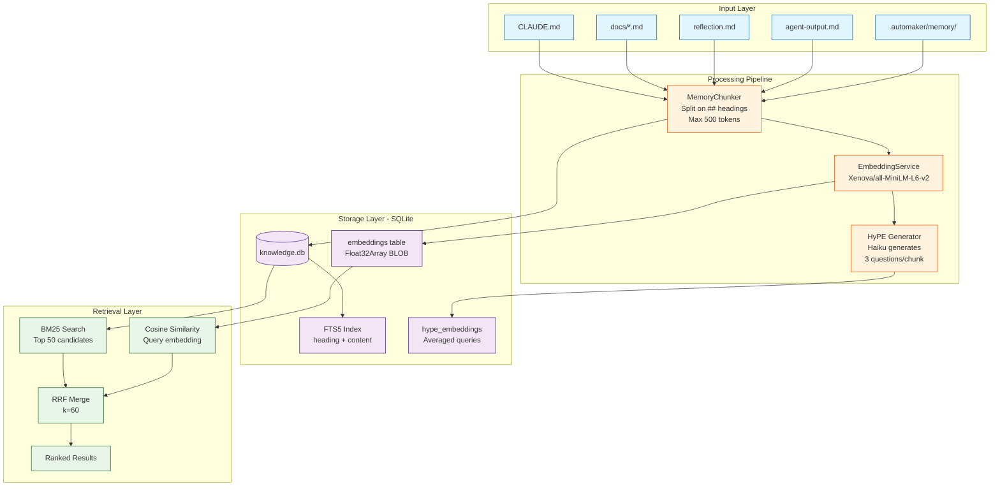

# Knowledge Hive

The Knowledge Hive is Automaker's persistent memory and retrieval system. It solves the problem of unbounded context window growth by indexing project knowledge into a searchable SQLite database with hybrid retrieval (BM25 + vector embeddings).

## The Problem

AI agents working on code have three fundamental knowledge challenges:

1. **Context Window Waste** — Including entire files wastes tokens. A 5000-line service file might only have 50 relevant lines for the current task.

2. **Unbounded Growth** — Each conversation turn adds to context. Without pruning, agents hit token limits and lose earlier context.

3. **Knowledge Silos** — Learnings from one feature aren't available to the next. Agents solve the same problems repeatedly.

The Knowledge Hive addresses all three by providing **on-demand retrieval** of relevant knowledge chunks instead of loading everything into context.

## Solution Architecture

```
┌─────────────────────────────────────────────────────────────────┐
│                         Knowledge Hive                          │
└─────────────────────────────────────────────────────────────────┘

Input Sources                     Processing Pipeline              Storage & Retrieval
━━━━━━━━━━━━━━━━                 ━━━━━━━━━━━━━━━━━━━              ━━━━━━━━━━━━━━━━━━

┌──────────────┐                  ┌──────────────┐                ┌─────────────────┐
│  CLAUDE.md   │                  │ MemoryChunker│                │  SQLite DB      │
│  README.md   │─────────────────▶│              │───────────────▶│  (knowledge.db) │
│  docs/*.md   │                  │  Split on    │                │                 │
└──────────────┘                  │  ## headings │                │ ┌─────────────┐ │
                                  │  Max 500 tok │                │ │ chunks      │ │
┌──────────────┐                  └──────────────┘                │ │  + FTS5     │ │
│ reflection.md│                         │                        │ └─────────────┘ │
│ agent-output │─────────────────────────┤                        │ ┌─────────────┐ │
└──────────────┘                         │                        │ │ embeddings  │ │
                                         │                        │ │  (BLOB)     │ │
┌──────────────┐                         ▼                        │ └─────────────┘ │
│ .automaker/  │                  ┌──────────────┐                └─────────────────┘
│  memory/*.md │─────────────────▶│ Embedding    │                         │
└──────────────┘                  │ Service      │                         │
                                  │              │                         │
                                  │ all-MiniLM   │                         ▼
                                  │  -L6-v2      │                ┌─────────────────┐
                                  └──────────────┘                │  Hybrid Search  │
                                         │                        │                 │
                                         │                        │  BM25 (50 cand) │
                                         ▼                        │      +          │
                                  ┌──────────────┐                │  Cosine Sim     │
                                  │   HyPE       │                │      =          │
                                  │  (Haiku)     │                │  RRF Merge      │
                                  │              │                └─────────────────┘
                                  │ Generate 3   │                         │
                                  │ questions    │                         │
                                  │ per chunk    │                         ▼
                                  └──────────────┘                ┌─────────────────┐
                                         │                        │  Results        │
                                         │                        │  (top N chunks) │
                                         ▼                        └─────────────────┘
                                  Averaged query
                                  embedding stored
                                  in chunks table
```

## Data Flow



## Component Responsibilities

### KnowledgeStoreService

The core service managing the SQLite database and hybrid retrieval pipeline.

**Location:** `apps/server/src/services/knowledge-store-service.ts`

**Key Methods:**

- `initialize(projectPath)` — Create or connect to `.automaker/knowledge.db`
- `search(projectPath, query, opts)` — Hybrid retrieval with BM25 + cosine similarity
- `findSimilarChunks(projectPath, text, sourceFile)` — Deduplication helper
- `rebuildIndex(projectPath)` — Refresh FTS5 index after new chunks added
- `ingestReflections(projectPath)` — Index all `reflection.md` files from features
- `ingestAgentOutputs(projectPath)` — Index agent output summaries
- `getStats()` — Return chunk counts, size, last updated timestamp
- `getEmbeddingStatus()` — Count of chunks with embeddings vs pending
- `getHypeStatus()` — Count of chunks with HyPE embeddings vs pending
- `compactCategory(projectPath, categoryFile, threshold)` — Summarize oversized memory files
- `pruneStaleChunks(projectPath)` — Delete chunks not retrieved in 90+ days

**Schema:**

```sql
-- Main chunks table
CREATE TABLE chunks (
  id TEXT PRIMARY KEY,
  source_type TEXT NOT NULL,        -- 'file', 'reflection', 'agent_output', etc.
  source_file TEXT NOT NULL,        -- Path relative to projectPath
  project_path TEXT NOT NULL,
  chunk_index INTEGER NOT NULL,
  heading TEXT,                     -- From ## heading
  content TEXT NOT NULL,
  tags TEXT,                        -- JSON array
  importance REAL NOT NULL DEFAULT 0.5,
  created_at TEXT NOT NULL,
  updated_at TEXT NOT NULL,
  last_retrieved_at TEXT,
  retrieval_count INTEGER NOT NULL DEFAULT 0,
  hype_queries TEXT,                -- JSON array of generated questions
  hype_embeddings BLOB              -- Averaged embedding from questions
);

-- FTS5 virtual table for full-text search
CREATE VIRTUAL TABLE chunks_fts USING fts5(
  heading,
  content,
  content=chunks,
  content_rowid=rowid
);

-- Embeddings table (stores vector embeddings as BLOB)
CREATE TABLE embeddings (
  chunk_id TEXT PRIMARY KEY,
  embedding BLOB NOT NULL,           -- Float32Array serialized
  model TEXT NOT NULL,               -- 'all-MiniLM-L6-v2'
  created_at TEXT NOT NULL,
  FOREIGN KEY (chunk_id) REFERENCES chunks(id) ON DELETE CASCADE
);
```

**Database Settings:**

- **WAL mode** enabled for concurrent reads
- **FTS5 triggers** keep the index in sync with chunks table
- Database path: `.automaker/knowledge.db` (per-project)

### EmbeddingService

Generates semantic embeddings using `@xenova/transformers` with the `all-MiniLM-L6-v2` model.

**Location:** `apps/server/src/services/embedding-service.ts`

**Key Methods:**

- `embed(text)` — Generate embedding for a single text string
- `embedBatch(texts)` — Generate embeddings for multiple texts
- `cosineSimilarity(a, b)` — Calculate cosine similarity between two vectors
- `isReady()` — Check if model is loaded

**Model Details:**

- **Model:** `Xenova/all-MiniLM-L6-v2`
- **Dimensions:** 384
- **Cache:** `DATA_DIR/models/` (persists across restarts)
- **Lazy Loading:** Model loads on first `embed()` call
- **Queue:** Requests during model load are queued and processed after ready

**Background Workers:**

1. **Background Embedding** — After chunks are added, asynchronously generate embeddings for all chunks missing them
2. **Background HyPE** — After embeddings complete, generate HyPE embeddings (Haiku + averaged queries)

**Why Xenova/transformers?**

- Pure JavaScript, no native bindings (works in Electron + Docker)
- Model caches to disk, no network dependency after first load
- Fast inference on CPU (~50ms per embedding)
- 384-dimensional embeddings are small enough for SQLite BLOB storage

### MemoryChunker

Utility for parsing and chunking markdown files into knowledge store chunks.

**Location:** `libs/utils/src/memory-chunker.ts`

**Strategy:**

1. Parse frontmatter (tags, importance)
2. Split on `##` headings if present
3. Each chunk = heading + content up to 500 tokens
4. Fallback to paragraph-based splitting if no `##` headings
5. Frontmatter metadata only attached to first chunk

**Key Functions:**

- `chunkMarkdownFile(fileContent)` — Parse and split a markdown file into chunks
- `estimateTokens(text)` — Approximate token count using word count × 1.3

**Output:**

```typescript
interface MemoryChunk {
  heading?: string;
  content: string;
  chunkIndex: number;
  tags?: string[];
  importance?: number;
}
```

## Hybrid Retrieval Pipeline

The Knowledge Hive uses **hybrid retrieval** combining BM25 (keyword-based) and cosine similarity (semantic) for best accuracy.

### Step 1: BM25 Full-Text Search

SQLite FTS5 returns the top 50 candidates ranked by BM25 score (lower is better).

```sql
SELECT c.*, bm25(chunks_fts) as score
FROM chunks_fts
JOIN chunks c ON chunks_fts.rowid = c.rowid
WHERE chunks_fts MATCH ?
ORDER BY score
LIMIT 50
```

**Why BM25?**

- Fast: SQLite FTS5 is optimized for full-text search
- Keyword-aware: Catches exact term matches (e.g., "KnowledgeStoreService")
- Built-in: No external dependencies

### Step 2: Cosine Similarity Ranking

Load embeddings for all 50 candidates and compute cosine similarity with the query embedding.

```typescript
const queryEmbedding = await embeddingService.embed(query);

for (const chunk of candidates) {
  const embedding = loadEmbedding(chunk.id);
  const similarity = cosineSimilarity(queryEmbedding, embedding);
  cosineSimilarities.set(chunk.id, similarity);
}
```

**Why Cosine Similarity?**

- Semantic: Catches conceptually similar content even without exact term matches
- Normalized: Similarity score is always between -1 (opposite) and 1 (identical)

### Step 3: RRF Merge

Combine BM25 and cosine rankings using **Reciprocal Rank Fusion** (RRF) with `k=60`.

```typescript
const k = 60;

for (const chunk of candidates) {
  const bm25Rank = getBM25Rank(chunk.id); // 1-based rank
  const cosineRank = getCosineRank(chunk.id); // 1-based rank

  const rrfScore = 1 / (k + bm25Rank) + 1 / (k + cosineRank);
  rrfScores.set(chunk.id, rrfScore);
}

// Sort by RRF score descending (higher is better)
results.sort((a, b) => rrfScores.get(b.id) - rrfScores.get(a.id));
```

**Why RRF?**

- No hyperparameters: Unlike weighted sum, RRF doesn't require tuning weights
- Robust: Works well even when one ranking is poor
- Standard: Used by Elastic, Pinecone, and other search systems

### Step 4: Token Budget Enforcement

Limit results to fit within a token budget (default: 8000 tokens).

```typescript
let totalTokens = 0;
const results = [];

for (const chunk of rankedChunks) {
  const chunkTokens = Math.ceil(chunk.content.length / 4);

  if (totalTokens + chunkTokens > maxTokens) {
    break; // Budget exhausted
  }

  results.push(chunk);
  totalTokens += chunkTokens;
}
```

### Fallback: BM25-Only Mode

If embeddings are unavailable (model not loaded, no embeddings generated yet), the system falls back to pure BM25.

## HyPE: Hypothetical Phrase Embeddings

HyPE is a zero-runtime-cost technique for improving semantic search accuracy.

### The Problem with HyDE

**HyDE (Hypothetical Document Embeddings)** generates a hypothetical answer to the query, then embeds the answer instead of the query. This improves recall but has a critical flaw for our use case:

- **Runtime cost:** Every search requires a Haiku API call to generate the hypothetical answer
- **Latency:** Adds ~500ms to every search
- **API cost:** 48 searches/day × 30 days = 1440 Haiku calls/month

### HyPE Solution

Instead of generating hypothetical answers at search time, we **pre-generate hypothetical questions at index time**.

**Indexing Pipeline (one-time cost):**

1. For each chunk, use Haiku to generate 3 short questions the chunk answers
2. Embed all 3 questions
3. Average the embeddings to create a single representative query embedding
4. Store the averaged embedding in `chunks.hype_embeddings`

**Search Pipeline (zero additional cost):**

1. Embed the user's query (already happening)
2. Compare query embedding to `hype_embeddings` instead of `embeddings`
3. Chunks that answer similar questions rank higher

**Result:** Same semantic accuracy as HyDE, but with **zero runtime cost** after initial indexing.

**Rate Limiting:** HyPE generation is rate-limited to 10 Haiku calls/minute to avoid API quota issues. The background worker processes chunks asynchronously without blocking the main application.

## API Endpoints

All knowledge store operations are exposed via REST API.

**Base Path:** `/api/knowledge`

### POST /search

Search the knowledge store using hybrid retrieval.

**Request Body:**

```typescript
{
  projectPath: string;
  query: string;
  maxResults?: number;      // Default: 20
  maxTokens?: number;       // Default: 8000
  sourceTypes?: string[];   // Filter by source type, or 'all'
}
```

**Response:**

```typescript
{
  results: Array<{
    chunk: {
      id: string;
      sourceType: string;
      sourceFile: string;
      heading?: string;
      content: string;
      tags?: string[];
      importance: number;
    };
    score: number;
  }>;
  retrieval_mode: 'hybrid' | 'bm25';
  totalTokens: number;
}
```

### GET /stats

Get statistics about the knowledge store.

**Query Parameters:**

- `projectPath` (required)

**Response:**

```typescript
{
  totalChunks: number;
  totalSizeBytes: number;
  uniqueSources: number;
  sourceTypeBreakdown: {
    file: number;
    reflection: number;
    agent_output: number;
    manual: number;
    generated: number;
  };
  lastUpdated?: string;
  dbPath: string;
  enabledHybridRetrieval: boolean;
}
```

### POST /ingest/reflections

Index all `reflection.md` files from features.

**Request Body:**

```typescript
{
  projectPath: string;
}
```

**Response:**

```typescript
{
  indexed: number;
}
```

### POST /ingest/agent-outputs

Index all `agent-output.md` files from features (last 2000 characters only).

**Request Body:**

```typescript
{
  projectPath: string;
}
```

**Response:**

```typescript
{
  indexed: number;
}
```

## Configuration

Configuration is stored in `.automaker/settings.json` under the `knowledgeStore` key.

```typescript
interface KnowledgeStoreSettings {
  maxChunkSize: number; // Default: 1000 tokens
  chunkOverlap: number; // Default: 200 tokens (unused, reserved)
  defaultImportance: number; // Default: 0.5
  autoReindex: boolean; // Default: true
  excludePatterns: string[]; // Glob patterns to exclude
  includePatterns: string[]; // Glob patterns to include
  hybridRetrieval: boolean; // Default: true (falls back to BM25 if false)
}
```

**Environment Variables:**

- `DATA_DIR` — Base directory for embedding model cache (default: `./data`)

## Deployment Considerations

### Electron Desktop App

**Pros:**

- SQLite works natively
- `@xenova/transformers` runs in main process
- Model cache persists in user data directory

**Cons:**

- First-time model download requires ~90MB (cached afterward)
- CPU-only inference (~50ms per embedding)

### PWA / Web Browser

**Not currently supported.** Browser limitations:

- SQLite requires WASM build (not implemented)
- `@xenova/transformers` works in Web Workers, but model download is ~90MB per session (no persistent cache)
- IndexedDB could replace SQLite, but FTS5 doesn't exist in browser

**Future Work:** Consider a server-side knowledge store for PWA deployments.

## Performance Characteristics

**Query Latency:**

- BM25-only: ~5-10ms
- Hybrid (50 candidates): ~100-150ms
- HyPE (query + cosine): ~120-180ms

**Indexing Throughput:**

- Chunk insertion: ~1000 chunks/second
- Embedding generation: ~20 chunks/second (CPU-bound)
- HyPE generation: ~10 chunks/minute (API rate-limited)

**Storage:**

- Chunks: ~1KB average per chunk
- Embeddings: 1.5KB per chunk (384 floats × 4 bytes)
- HyPE embeddings: 1.5KB per chunk
- Total: ~4KB per chunk

**Corpus Size Limits:**

- SQLite handles millions of rows efficiently
- FTS5 index scales logarithmically
- Practical limit: ~100k chunks per project (~400MB database)

## Usage Patterns

### From Agent Prompts

Agents can search knowledge via system prompt instructions:

```markdown
Before modifying code, search the knowledge store:

Query: "KnowledgeStoreService initialization pattern"
Use the top 3 results to inform your implementation.
```

### From MCP Tools

The Automaker MCP server exposes knowledge search:

```typescript
mcp__automaker__search_knowledge({
  projectPath: '/path/to/project',
  query: 'how to add a new memory category',
  maxResults: 5,
});
```

### From UI

The Automaker UI (future) will include a knowledge search panel.

## Debugging

### Check Embedding Status

```bash
curl http://localhost:3008/api/knowledge/stats?projectPath=/path/to/project
```

Look for `enabledHybridRetrieval: false` if embeddings aren't working.

### Inspect Database

```bash
sqlite3 .automaker/knowledge.db

-- List all chunks
SELECT id, source_type, heading, length(content) as len FROM chunks;

-- Check FTS5 index
SELECT * FROM chunks_fts WHERE chunks_fts MATCH 'search term';

-- Check embeddings
SELECT COUNT(*) FROM embeddings;
```

### Force Rebuild Index

```typescript
POST /api/knowledge/rebuild
{
  "projectPath": "/path/to/project"
}
```

## Maintenance

### Compaction

Memory category files that exceed 50,000 tokens trigger automatic compaction via Haiku summarization.

```typescript
await knowledgeStoreService.compactCategory(projectPath, 'patterns.md', 50000);
```

### Pruning

Chunks with zero retrievals and no access in 90+ days are automatically pruned.

```typescript
const deleted = knowledgeStoreService.pruneStaleChunks(projectPath);
// Returns count of deleted chunks
```

## Next Steps

- **[RAG Techniques](./rag-techniques)** — Deep dive into RAG technique decisions
- **[Memory System](./memory-system)** — How learnings are written and retrieved
