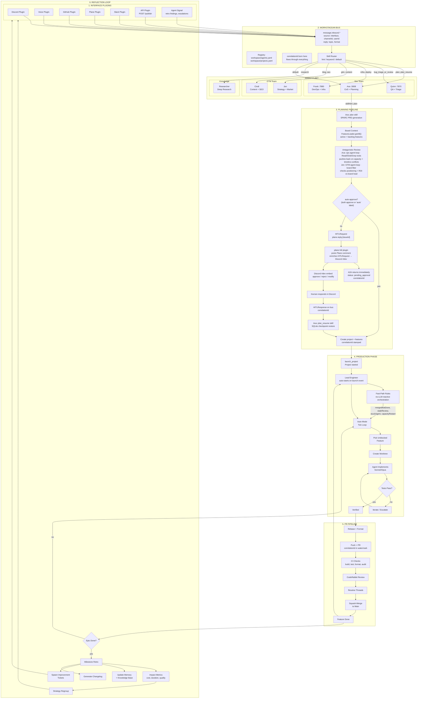

# protoLabs Agency System — Architecture

## System Architecture Diagram



## Pipeline

For the complete 8-phase pipeline reference (TRIAGE through PUBLISH), see [Idea to Production](../../concepts/pipeline.md).

## Operations + Engineering Split

The agency is organized into two branches with clear boundaries:

### Operations (Ava, Chief of Staff)

Signal triage, quality gates, team health, and external communication.

- **Signal classification** — Routes incoming ideas, bugs, ops improvements, GTM work
- **Antagonistic review** — Ava runs as an ops agent-loop (Read/Glob/Grep tools, board context) alongside Jon (GTM agent-loop, brand filter); both can push back on capacity conflicts, timeline misalignment, or weak business case before approval
- **Lead Engineer** — Event-driven orchestrator with fast-path rules, state machine
- **Ceremonies** — Standup, retro, project-retro via Discord
- **Discord comms** — Status updates, alerts, Josh coordination

### Engineering (Lead Engineer)

Production orchestration, auto-mode execution, and code quality.

- **Lead Engineer** — Event-driven orchestrator with fast-path rules (no LLM for routine decisions)
- **Auto-mode** — Dependency-aware feature processing with model escalation
- **Worktree isolation** — Per-feature git worktrees protect main branch
- **Agent execution** — Sonnet for standard work, Opus for architectural, Haiku for mechanical
- **PR pipeline** — Rebase → push → CI → CodeRabbit → thread resolution → merge
- **CI/CD guardrails** — Build, test, format, audit checks on every PR

### Cross-Cutting

- **Domain tools** — SharedTool system with Zod schemas, used across MCP/LangGraph/Express
- **Antagonistic review** — Bridges ops (Ava feasibility) and engineering (Jon market value)
- **HITL gates** — Human approval at milestone boundaries, optional interrupt-before in flows
- **Langfuse observability** — Traces and cost tracking across all agent execution

## Agent Communication Topology

```
                         Josh (Human)
                    ↕ Any Interface Plugin
                   (Discord / Voice / Slack / GitHub / Plane / API)
                              │
                    ┌─────────┴─────────┐
                    │  Workstacean Bus   │
                    │  correlationId     │
                    │  agents.yaml       │
                    │  projects.yaml     │
                    └─────────┬─────────┘
                              │
                         Ava (CoS)
              ╱         │         ╲
     Dev Team      Cross-cut     GTM Team
      ╱    ╲          │           ╱    ╲
  Quinn   Frank    Antag.      Jon    Cindi
   (QA)  (DevOps) Review     (GTM) (Content)
                               │
                          Researcher
                         (Knowledge)
                              │
                         Lead Eng
                        (Orchestr.)
                              │
                         Auto-mode
                        ╱    │    ╲
                    Agent₁ Agent₂ Agent₃
                   (Sonnet)(Sonnet)(Haiku)
                        ╲    │    ╱
                         PR Pipeline
                        (Lead Engineer)
```

Ava is the hub. All strategic decisions flow through her. Workstacean is the spine — it routes signals from any interface plugin to the right agent and carries the correlationId through the entire lifecycle.

Communication channels:

- **Workstacean bus** for all inter-agent routing (`message.inbound.*`, `message.outbound.*`)
- **Interface plugins** for human-facing I/O (Discord, voice, Slack, GitHub, Plane, raw API)
- **MCP tools** for system operations (48+ tools)
- **Events** for system-to-system (`feature:completed`, `project:lifecycle:launched`, etc.)
- **Agent memory** for persistent cross-session learning
- **Domain tools** for feature management, git ops, and project orchestration
- **HITL loop** via bus — HITLRequest/HITLResponse flow through interface plugins back to Ava

## Component Inventory

| Component                       | Location                                                    | Notes                                                   |
| ------------------------------- | ----------------------------------------------------------- | ------------------------------------------------------- |
| **Idea processing flow**        | `libs/tools/src/domains/ideas/process-idea.ts`              | LangGraph flow with HITL checkpoints                    |
| **Antagonistic review**         | `apps/server/src/services/antagonistic-review-service.ts`   | 3-stage: Ava ops → Jon market → consolidated resolution |
| **Antagonistic review adapter** | `apps/server/src/services/antagonistic-review-adapter.ts`   | LangGraph flow wrapper with Langfuse tracing            |
| **Lead Engineer service**       | `apps/server/src/services/lead-engineer-service.ts`         | Production orchestrator with fast-path rules            |
| **Lead Engineer rules**         | `apps/server/src/services/lead-engineer-rules.ts`           | 8 pure-function rules (no LLM, no service imports)      |
| **SharedTool system**           | `libs/tools/src/types.ts`, `define-tool.ts`                 | Zod-validated tool definitions for MCP/LangGraph/REST   |
| **Feature domain tools**        | `libs/tools/src/domains/features/`                          | CRUD operations via SharedTool pattern                  |
| **Project lifecycle**           | `apps/server/src/services/project-lifecycle-service.ts`     | 6 MCP tool steps from idea to launch                    |
| **submit_prd MCP tool**         | `packages/mcp-server/src/index.ts`                          | Creates epic, ProjM decomposes                          |
| **SPARC PRD skill**             | `plugins/automaker/commands/sparc-prd.md`                   | Interactive PRD creation                                |
| **ProjM deep research**         | `apps/server/src/services/authority-agents/`                | Milestone/phase decomposition                           |
| **Auto-mode execution**         | `apps/server/src/services/auto-mode-service.ts`             | Dependency-aware, model escalation                      |
| **Worktree isolation**          | `apps/server/src/services/agent-service.ts`                 | Per-feature branches                                    |
| **PR pipeline**                 | `apps/server/src/services/git-workflow-service.ts`          | Create, push, merge                                     |
| **CodeRabbit integration**      | Branch protection + `resolve_review_threads`                | Required check                                          |
| **CI/CD**                       | `.github/workflows/`                                        | Build, test, format, audit                              |
| **Ceremony service**            | `apps/server/src/services/ceremony-service.ts`              | Standup, retro, project-retro                           |
| **Lead Engineer rules**         | `apps/server/src/services/lead-engineer-rules.ts`           | 8 pure-function rules (no LLM, no service imports)      |
| **Escalation pipeline**         | `apps/server/src/services/escalation-router.ts`             | 5 channels, SLA engine                                  |
| **Signal accumulator**          | `apps/server/src/services/`                                 | Severity classification + briefing                      |
| **Agent memory**                | `.automaker/memory/*.md`                                    | Per-agent learning files                                |
| **Discord MCP**                 | `packages/mcp-server/plugins/automaker/`                    | Send, read, channels, webhooks                          |
| **Idea processing service**     | `apps/server/src/services/idea-processing-service.ts`       | Session management for LangGraph idea flow              |
| **Content review pipeline**     | `libs/flows/src/content/subgraphs/antagonistic-reviewer.ts` | 8-dimension scoring for content quality                 |

## Quality Guardrails

Four layers of quality assurance protect the pipeline:

### 1. Antagonistic Review

Every PRD passes through a 3-stage sequential review before approval:

1. **Ava (operational feasibility)** — Capacity, risk, technical debt, implementation feasibility
2. **Jon (market value)** — Customer impact, ROI, positioning, priority. Sees Ava's critique.
3. **Resolution (Ava as CoS)** — Merges both verdicts into consolidated PRD with final decision

Uses LangGraph flows with Langfuse tracing. 3-minute timeout for the entire pipeline.

### 2. HITL Gates

- **Bus-routed approval** — HITLRequest published to originating interface plugin's reply.topic; human responds via the same interface (Discord embed, voice prompt, Slack button, etc.); HITLResponse flows back through bus to Ava's `plan_resume` skill
- **Auto-approval path** — when both Ava (operational) and Jon (strategic) score > 4.0, HITL is skipped and project is created immediately
- **correlationId continuity** — the same correlationId from intake flows through HITL round-trip and into the created project
- Optional interrupt-before in LangGraph flows
- preApproved path for low-risk operational items

### 3. CI Pipeline

Required checks on every PR before merge:

- `build` — TypeScript compilation
- `test` — Playwright E2E + Vitest unit
- `format` — Prettier formatting
- `audit` — Security audit

### 4. Code Quality

- **CodeRabbit** — AI-powered code review (required check)
- **Branch protection** — Squash-only merges, required status checks, admin bypass
- **TypeScript strict mode** — Catches type errors at compile time
- **Prettier** — Enforced formatting consistency
- **Thread resolution** — All review threads must be resolved before merge

## Data Flow

### System of Record Boundaries

```
┌──────────────────────────────────────────────────────┐
│         WORKSTACEAN (Bus + Registry)                  │
│  workspace/agents.yaml — authoritative agent registry │
│  workspace/projects.yaml — project registry           │
│  GET /api/agents, GET /api/projects — consumed by fleet│
│  POST /publish — external services inject messages    │
│  correlationId minted here, flows through all systems │
├──────────────────────────────────────────────────────┤
│           AUTOMAKER BOARD (Source of Truth)            │
│  Projects, Features, Agents, Worktrees, Dependencies  │
│  Auto-mode, Milestones, Roadmap                       │
│  ↕ Git operations (branches, PRs, merges)             │
├──────────────────────────────────────────────────────┤
│                    GITHUB (Code)                       │
│  Repository, Branches, PRs, CI, CodeRabbit            │
│  ↕ Webhooks + API (status updates, PR events)         │
├──────────────────────────────────────────────────────┤
│              INTERFACE PLUGINS (Comms)                 │
│  Discord, Voice, Slack, GitHub, Plane, API            │
│  Status updates, Ceremonies, Alerts, Conversations    │
│  HITL rendering — each plugin owns its native UX      │
│  Read-only state — no persistent data                 │
├──────────────────────────────────────────────────────┤
│                 LANGFUSE (Observability)               │
│  Traces, costs, correlationId linkage                 │
│  Every agent execution traced end-to-end              │
└──────────────────────────────────────────────────────┘
```

## Scalability Considerations

### Current Limits

- 2-3 concurrent agents on dev hardware (8GB heap)
- 6-10 concurrent agents on staging (48GB heap limit, 125GB RAM, 24 CPUs)
- Agent turns limited (hit turn limit = uncommitted work)
- Lead Engineer fast-path rules run with zero LLM cost

### Scaling Strategy

- **Vertical**: Staging hardware handles more concurrent agents
- **Horizontal**: Multiple protoLabs instances via [Hivemind](../dev/instance-state.md#hivemind-multi-instance-mesh) — domain-scoped mesh where each instance owns a slice of the codebase
- **Efficiency**: Model routing (Haiku for mechanical work, Sonnet default, Opus only for architectural decisions or 2+ failures)
- **Fast-path rules**: Lead Engineer handles routine orchestration decisions (mergedNotDone, orphanedInProgress, staleDeps, autoModeHealth, staleReview, stuckAgent, capacityRestart, projectCompleting) without LLM calls
- **Automation**: Every manual step today becomes automated tomorrow — this is the self-improvement loop

### Instance State Model

protoLabs follows a **fresh state per instance** design. Operational state (board, task queue, project plans) is instance-local and ephemeral. Knowledge (agent memory, context files, skills, project spec) is shared via git.

This split is foundational for multi-instance scaling:

- **No distributed consensus** needed for operational state
- **Domain isolation** — each instance works on its assigned slice
- **Crash resilience** — code lives in git; a dead instance loses nothing permanent
- **setupLab onboarding** — new instances build context from research, not inherited state

See [Instance State Architecture](../dev/instance-state.md) for the full design.
