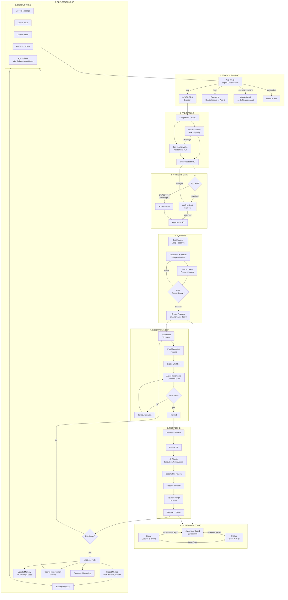

# ProtoLabs Agency System — Architecture

## System Architecture Diagram



## Component Inventory

### Exists and Working

| Component                    | Location                                            | Status  | Notes                               |
| ---------------------------- | --------------------------------------------------- | ------- | ----------------------------------- |
| **submit_prd MCP tool**      | `packages/mcp-server/src/index.ts`                  | Working | Creates epic, ProjM decomposes      |
| **SPARC PRD skill**          | `plugins/automaker/commands/sparc-prd.md`           | Working | Interactive PRD creation            |
| **ProjM deep research**      | `apps/server/src/services/authority-agents/`        | Working | Milestone/phase decomposition       |
| **Auto-mode execution**      | `apps/server/src/services/auto-mode-service.ts`     | Working | Dependency-aware, model escalation  |
| **Agent factory + registry** | `apps/server/src/services/agent-factory-service.ts` | Working | Template-based agent creation       |
| **Worktree isolation**       | `apps/server/src/services/agent-service.ts`         | Working | Per-feature branches                |
| **PR pipeline**              | `apps/server/src/services/git-workflow-service.ts`  | Working | Create, push, merge                 |
| **CodeRabbit integration**   | Branch protection + resolve_review_threads          | Working | Required check                      |
| **CI/CD**                    | `.github/workflows/`                                | Working | Build, test, format, audit          |
| **Linear sync (features)**   | `apps/server/src/services/linear-sync-service.ts`   | Working | Feature → Linear issue push         |
| **Linear webhook**           | `apps/server/src/routes/linear/webhook.ts`          | Working | Receives mentions/delegations       |
| **Ceremony service**         | `apps/server/src/services/ceremony-service.ts`      | Working | Standup, retro, project-retro       |
| **Crew loops**               | `apps/server/src/services/crew-loop-service.ts`     | Working | PR Maintainer, Board Janitor, Frank |
| **Escalation pipeline**      | `apps/server/src/services/escalation-router.ts`     | Working | 5 channels, SLA engine              |
| **Signal accumulator**       | `apps/server/src/services/`                         | Working | Severity classification + briefing  |
| **Agent memory**             | `.automaker/memory/*.md`                            | Working | Per-agent learning files            |
| **Beads task tracking**      | `.beads/issues.jsonl`                               | Working | Operational task queue              |
| **Discord MCP**              | `packages/mcp-server/plugins/automaker/`            | Working | Send, read, channels, webhooks      |
| **Conflict resolution UI**   | `apps/ui/src/`                                      | Working | Linear sync conflict handling       |

### Partially Built

| Component               | What Exists                              | What's Missing                                                           |
| ----------------------- | ---------------------------------------- | ------------------------------------------------------------------------ |
| **Signal intake**       | Discord/Linear/GitHub receive messages   | No auto-triage pipeline. Messages don't auto-trigger PRD creation.       |
| **Jon GTM agent**       | Template registered, `/gtm` skill exists | Not wired into PRD review pipeline. Only does standalone content work.   |
| **Linear project sync** | Feature-level sync works                 | Can't create Linear projects or documents programmatically. Only issues. |
| **Ceremonies**          | Discord posts on milestone events        | Don't spawn improvement tickets. Don't capture learnings systematically. |
| **HITL approval**       | Linear agent sessions, elicitation tools | No structured approval gate for milestones/scope in Linear.              |
| **preApproved flag**    | submit_prd creates features directly     | No trust-boundary logic for auto-approval vs. human review.              |

### Doesn't Exist Yet

| Component                            | Purpose                                                   | Priority                                                 |
| ------------------------------------ | --------------------------------------------------------- | -------------------------------------------------------- |
| **Antagonistic review**              | Ava + Jon cross-challenge PRDs before approval            | Critical — prevents garbage-in                           |
| **Unified signal router**            | Any signal source → classification → correct pipeline     | Critical — intake bottleneck                             |
| **Retro → improvement tickets**      | Ceremony retros auto-create Beads/Linear items            | High — closes the loop                                   |
| **Linear project/document creation** | Programmatic project + doc creation in Linear             | High — can't be automation agency with manual Linear ops |
| **Automated changelog**              | Generate changelog from merged features per epic/project  | Medium — visibility                                      |
| **Metrics-driven impact analysis**   | "Was this project worth it?" automated analysis           | Medium — accountability                                  |
| **Knowledge synthesis**              | Project-level learning rollup (not just per-agent memory) | Medium — organizational learning                         |
| **preApproved trust boundaries**     | Rules: complexity ≤ small + category = ops → auto-approve | Medium — removes bottleneck                              |

## Data Flow

### Signal → Production

```
Signal (Discord/Linear/GitHub)
  ↓
Ava classifies signal type and urgency
  ↓
[idea] → SPARC PRD created
  ↓
Antagonistic review: Ava ↔ Jon
  ↓
Consolidated PRD → Linear document
  ↓
Approval gate (Josh or preApproved)
  ↓
ProjM: deep research → milestones → phases
  ↓
Linear project + Automaker board features
  ↓
Auto-mode picks features in dependency order
  ↓
Agent implements in worktree → tests → verified
  ↓
PR pipeline: rebase → push → CI → CodeRabbit → merge
  ↓
Feature → done, sync to Linear
  ↓
Epic complete → ceremony (retro + metrics)
  ↓
Improvement tickets + knowledge update → REPEAT
```

### System of Record Boundaries

```
┌──────────────────────────────────────────────────────┐
│                    LINEAR (Strategic)                  │
│  Projects, Milestones, Roadmap, Human Reviews         │
│  ↕ Bidirectional sync (issue status, labels, fields)  │
├──────────────────────────────────────────────────────┤
│                 AUTOMAKER BOARD (Tactical)             │
│  Features, Agents, Worktrees, Dependencies, Auto-mode │
│  ↕ Git operations (branches, PRs, merges)             │
├──────────────────────────────────────────────────────┤
│                    GITHUB (Code)                       │
│  Repository, Branches, PRs, CI, CodeRabbit            │
│  ↕ Webhooks + API (status updates, PR events)         │
├──────────────────────────────────────────────────────┤
│                   DISCORD (Comms)                      │
│  Status updates, Ceremonies, Alerts, Conversations    │
│  Read-only state — no persistent data                 │
└──────────────────────────────────────────────────────┘
```

### Agent Communication Topology

```
                    Josh (Human)
                    ↕ Discord / Linear
                   Ava (CoS)
                 ↙    ↓    ↘
              Jon    ProjM    Frank
             (GTM)  (Plan)   (DevOps)
                      ↓
                   Features
                 ↙    ↓    ↘
            Agent₁  Agent₂  Agent₃
            (Sonnet) (Sonnet) (Haiku)
                 ↘    ↓    ↙
               PR Maintainer (Crew)
               Board Janitor (Crew)
```

Ava is the hub. All strategic decisions flow through her. Agents communicate via:

- **MCP tools** for system operations
- **Discord** for human-facing updates
- **Events** for system-to-system (feature:completed, milestone:started, etc.)
- **Agent memory** for persistent cross-session learning

## Scalability Considerations

### Current Limits

- 2-3 concurrent agents on dev hardware (8GB heap)
- 6-10 concurrent agents on staging (32GB heap, 125GB RAM)
- Linear MCP has basic CRUD only (no project/doc creation)
- Agent turns limited (hit turn limit = uncommitted work)

### Scaling Strategy

- **Vertical**: Staging hardware handles more concurrent agents
- **Horizontal**: Multiple Automaker instances per project (future)
- **Efficiency**: Model routing (Haiku for mechanical work, Opus only for architectural decisions)
- **Automation**: Every manual step today becomes automated tomorrow — this is the self-improvement loop
