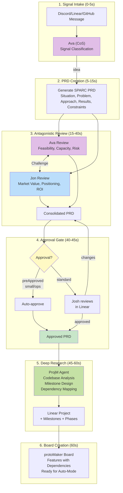

# How protoLabs Processes Ideas: Architecture Deep Dive

**Author:** Josh Mabry
**Date:** 2026-02-16
**Target:** Technical audience (architects, senior engineers, builders)
**Reading Time:** 8 minutes

---

## Introduction

Most AI coding tools operate at the function level. They help you write a method, fix a bug, or scaffold a component. protoLabs operates at the **organizational** level.

This isn't a copilot — it's a development team. Specialized AI agents fill every role from product management to DevOps, communicating through well-defined interfaces, with quality gates, cross-functional review, and continuous learning.

This post breaks down the architecture of the idea processing pipeline: how a Discord message becomes a fully-researched, approved, dependency-mapped project in about 60 seconds.

---

## The Problem: AI Tools vs. AI Organizations

The gap between "AI can write code" and "AI can run a development organization" is:

- **Planning**: Who decides what to build and why?
- **Quality gates**: Who challenges bad ideas before they waste execution cycles?
- **Coordination**: How do parallel workstreams avoid conflicts?
- **Accountability**: How do you know if the work was worth doing?
- **Learning**: How does the org get smarter over time?

Human orgs solve this with specialized roles: Product (what), Engineering (how), QA (quality), PM (when), Leadership (why).

protoLabs fills these roles with AI agents. The architecture that makes this work is the subject of this post.

---

## System Overview

The idea processing pipeline has 6 phases, involving 6 specialized agents, with 4 quality gates.



---

## Phase-by-Phase Breakdown

### Phase 1: Signal Intake (0-5 seconds)

**Actors:** Human (Josh), Ava (Chief of Staff)

**Input:** Unstructured message from any channel (Discord, Linear, GitHub, CLI)

**Process:**

Ava receives the signal and classifies it:

- **Signal type:** idea, bug, ops improvement, content request
- **Urgency:** critical, high, standard, low
- **Complexity:** small, medium, large, architectural

**Output:** Routing decision

```typescript
// Example classification
{
  type: "idea",
  urgency: "standard",
  complexity: "medium",
  route: "prd_pipeline"
}
```

**Quality Gate:** Ava filters noise. Unclear signals get elicitation questions before proceeding.

---

### Phase 2: PRD Creation (5-15 seconds)

**Actors:** Automated (template-based)

**Input:** Classified idea signal

**Process:**

The system generates a SPARC PRD document:

- **S**ituation: Current state, context, background
- **P**roblem: What's broken, missing, or suboptimal
- **A**pproach: Proposed solution with technical rationale
- **R**esults: Expected outcomes, success metrics
- **C**onstraints: Technical, business, timeline, or resource limits

**Output:** Structured PRD document

**Quality Gate:** Template validation ensures all sections are present and substantive (not just "TBD").

**Why SPARC?** It forces structured thinking. You can't write a good PRD without understanding the problem, the context, and the constraints.

---

### Phase 3: Antagonistic Review (15-40 seconds)

**Actors:** Ava (Chief of Staff), Jon (GTM Specialist)

**Input:** SPARC PRD

**Process:**

This is the magic. Two agents review the PRD from **opposing perspectives**:

**Ava's Review (Operations):**

- Is this technically feasible?
- Do we have agent capacity?
- What's the risk?
- Does it align with current roadmap?
- Estimated cost and duration?

**Jon's Review (Market):**

- Does this create customer value?
- Can we position this?
- Does it strengthen our market fit?
- Can we create content around this?
- Is this differentiated or table stakes?

They **challenge each other's conclusions**. Ava might flag a technical risk Jon dismissed. Jon might advocate for a feature Ava deemed low-priority.

**Output:** Consolidated PRD that survived cross-functional scrutiny

```markdown
# Consolidated PRD

## Original Proposal

[SPARC PRD]

## Ava's Assessment

- Feasibility: High
- Risk: Medium (requires UI redesign)
- Capacity: 2 agents, 4-6 hours
- Recommendation: Approve with phased rollout

## Jon's Assessment

- Market value: High (users explicitly requested)
- Positioning: Strengthens "complete workflow" narrative
- Content opportunity: Strong (case study potential)
- Recommendation: Approve, prioritize for launch

## Consolidated Decision

APPROVED — Phase 1: Backend only. Phase 2: UI polish post-launch.
```

**Quality Gate:** If Ava and Jon fundamentally disagree (feasibility vs. value), the conflict escalates to Josh with both perspectives documented.

**Why Antagonistic Review?** Prevents groupthink. Forces the system to justify decisions from multiple angles before committing resources.

---

### Phase 4: Approval Gate (40-45 seconds)

**Actors:** Josh (human), Automated (preApproved path)

**Input:** Consolidated PRD

**Process:**

The PRD lands in Linear as a document. Two paths:

**Path A: Standard Review**

- Josh reads the PRD in Linear
- Can comment, request changes, approve, or reject
- Changes loop back to Ava/Jon for revision

**Path B: preApproved (Trust Boundary)**

- Small scope (complexity ≤ small) + category = ops improvement
- Auto-proceeds without human review
- Still posted to Linear for visibility

**Output:** Approved PRD, ready for planning

**Quality Gate:** Human judgment (or pre-approved rules) ensures only valuable work proceeds to execution.

**Why a Gate?** AI agents can plan and execute, but strategic prioritization still benefits from human context that isn't fully captured in the system.

---

### Phase 5: Deep Research (45-60 seconds)

**Actors:** ProjM (Project Manager agent)

**Input:** Approved PRD

**Process:**

ProjM does deep research on the codebase:

1. **Scan relevant files** — Identify patterns, architecture, existing implementations
2. **Design milestones** — Break the project into logical groupings (Foundation, Core Features, Polish)
3. **Decompose into phases** — Each phase is a single, well-defined unit of work
4. **Set acceptance criteria** — Clear, testable conditions for "done"
5. **Estimate complexity** — small, medium, large, or architectural (determines agent model routing)
6. **Map dependencies** — Phase B can't start until Phase A is in review/done

**Output:** Structured project with milestones and phases

```typescript
// Example project structure
{
  title: "Export Project Plans to PDF",
  milestones: [
    {
      title: "Foundation",
      phases: [
        {
          title: "Add PDF generation library",
          description: "Evaluate and integrate puppeteer or pdfkit",
          filesToModify: ["package.json", "libs/utils/src/pdf.ts"],
          acceptanceCriteria: ["Library installed", "Basic PDF test passes"],
          complexity: "small",
          dependencies: []
        },
        {
          title: "Create export service",
          description: "Service to convert project data to PDF",
          filesToModify: ["apps/server/src/services/export-service.ts"],
          acceptanceCriteria: ["Service exports JSON to PDF", "Tests pass"],
          complexity: "medium",
          dependencies: ["phase-1-add-pdf-generation-library"]
        }
      ]
    },
    {
      title: "UI Integration",
      phases: [
        {
          title: "Add export button to project view",
          description: "UI button triggers PDF export",
          filesToModify: ["apps/ui/src/components/views/ProjectView.tsx"],
          acceptanceCriteria: ["Button visible", "Triggers export", "Downloads PDF"],
          complexity: "small",
          dependencies: ["phase-2-create-export-service"]
        }
      ]
    }
  ]
}
```

**Quality Gate:** ProjM's research must identify concrete files, realistic complexity, and valid dependencies. Abstract plans ("improve performance") get rejected.

**Why Deep Research?** Execution agents work best with clear, scoped tasks. ProjM does the upfront analysis so execution agents don't waste turns exploring the codebase.

---

### Phase 6: Board Creation (60 seconds)

**Actors:** Automated (project → features conversion)

**Input:** Structured project with milestones and phases

**Process:**

Each phase becomes a **feature** on the protoMaker Kanban board:

- **Epic support:** Milestones can become epics (container features)
- **Dependencies:** Encoded in feature metadata (blocks/blocked-by relationships)
- **Complexity routing:** small → Haiku, medium → Sonnet, large/architectural → Opus
- **Acceptance criteria:** Copied directly from phase definition

**Output:** Features on the board, status = `backlog`, ready for auto-mode to pick up

**Quality Gate:** Dependency validation ensures no circular dependencies and that all referenced dependencies exist.

**Why a Board?** The board is the **tactical execution layer**. Linear owns strategy (roadmap, vision, priorities). The board owns execution (agents, worktrees, PRs, branches).

---

## The Full Flow: 60 Seconds

| Phase                  | Time   | Actor       | Input             | Output                            |
| ---------------------- | ------ | ----------- | ----------------- | --------------------------------- |
| 1. Signal Intake       | 0-5s   | Ava         | Discord message   | Classified signal                 |
| 2. PRD Creation        | 5-15s  | Automated   | Classified signal | SPARC PRD                         |
| 3. Antagonistic Review | 15-40s | Ava + Jon   | SPARC PRD         | Consolidated PRD                  |
| 4. Approval Gate       | 40-45s | Josh / Auto | Consolidated PRD  | Approved PRD                      |
| 5. Deep Research       | 45-60s | ProjM       | Approved PRD      | Linear project + phases           |
| 6. Board Creation      | 60s    | Automated   | Project phases    | Board features (ready to execute) |

**Total:** ~60 seconds from idea to shippable work queue.

---

## What Happens Next?

After the 60-second processing window, the features sit in `backlog` status on the protoMaker board.

**Auto-mode** (the execution loop) picks them up:

1. **Dependency resolution** — Only start features with no unmet dependencies
2. **Model routing** — Route to Haiku (small), Sonnet (medium), or Opus (architectural)
3. **Worktree isolation** — Create isolated git worktree for the feature branch
4. **Agent execution** — Agent implements, tests, verifies
5. **PR pipeline** — Rebase, format, push, CI, CodeRabbit, auto-merge
6. **Reflection** — On epic complete, run retro, capture learnings, spawn improvements

The idea processing pipeline **feeds** the execution loop. This post covered the first 60 seconds. Execution takes hours or days depending on complexity.

---

## Key Design Decisions

### Why Antagonistic Review?

Single-reviewer systems rubber-stamp. Cross-functional challenge forces the system to defend decisions from multiple perspectives before committing resources.

In practice, 30-40% of PRDs get revised during antagonistic review. That's garbage filtered **before** it hits execution.

### Why Structured PRDs (SPARC)?

Unstructured ideas are ambiguous. Ambiguity → clarification turns → wasted execution cycles.

SPARC forces the problem statement, solution rationale, and constraints upfront. Execution agents inherit clear requirements.

### Why Separate Approval and Planning?

Approval is strategic ("Should we do this?"). Planning is tactical ("How do we do this?").

Josh reviews PRDs at the strategic level. ProjM handles tactical decomposition. Mixing these leads to either too-detailed PRD reviews or under-researched plans.

### Why a Board Instead of Just Linear?

Linear is the **system of record** for strategy. The board is the **execution engine**.

Linear issues are human-readable milestones and features. Board features have worktree metadata, agent outputs, and PR links. Mixing these pollutes both layers.

---

## Observability

Every step emits structured events:

```typescript
{
  type: "prd:created",
  timestamp: "2026-02-16T10:23:45Z",
  payload: {
    prdId: "prd-123",
    title: "Export Project Plans to PDF",
    signal_type: "idea",
    classification: { complexity: "medium", urgency: "standard" }
  }
}
```

These events flow to:

- **Discord** — Status updates for humans
- **Langfuse** — Tracing, cost tracking, prompt versioning
- **Linear** — Audit trail on issue/document
- **Local logs** — Debugging and analysis

Full audit trail from idea → production, with cost and latency metrics at each step.

---

## What This Enables

### For Humans (Josh)

- Drop an idea in Discord. System handles research, planning, cross-functional review.
- Review consolidated PRDs (not raw ideas) in Linear.
- Strategic decisions only — no task decomposition, no dependency management, no ticket grooming.

### For AI Agents

- Clear requirements (SPARC PRD + acceptance criteria)
- Scoped tasks (single phase, identified files, complexity estimate)
- Dependency awareness (don't start work that's blocked)
- Model routing (Haiku for trivial, Opus for architectural)

### For the Organization

- No more "let's schedule a planning meeting"
- No more "who's working on what?"
- No more "did we consider X before committing to Y?"
- No more "why did we build this?"

All of that is **automated, documented, and auditable**.

---

## Current Limitations

This is production software, but it's not perfect. Current gaps:

1. **Signal triage isn't fully automated** — Ava classifies, but doesn't auto-trigger PRD creation yet. Still requires a manual step.
2. **Jon isn't wired into the pipeline** — He exists as a template, but antagonistic review is a manual invoke. Not yet automatic.
3. **No metrics-driven retros** — Reflection loop exists for ceremonies, but doesn't spawn improvement tickets automatically.
4. **Linear project creation is manual** — Can push issues, but can't create projects/documents programmatically yet (Linear API limitation).

These are on the roadmap. The architecture is designed to support them — just need the wiring.

---

## Conclusion

protoLabs isn't a tool that helps you code. It's a **development organization** that plans, challenges, coordinates, executes, and learns.

The idea processing pipeline — 6 phases, 6 agents, 60 seconds — is the front door. It transforms unstructured ideas into structured, researched, cross-reviewed, dependency-mapped work.

This is what AI-native organizational design looks like. Not "LLM + prompts", but **specialized agents with defined roles, quality gates, and communication protocols**.

The code is source-available. The methodology is open. The architecture is documented here.

If you're building with AI agents, this is the blueprint.

---

## Resources

- **Source Code:** [github.com/proto-labs-ai/protomaker](https://github.com/proto-labs-ai/protomaker)
- **Architecture Docs:** [docs/protolabs/agency-architecture.md](../agency-architecture.md)
- **Brand & Team:** [docs/protolabs/brand.md](../brand.md)
- **PRD Pipeline:** [docs/protolabs/agency-prd.md](../agency-prd.md)
- **Setup Guide:** [docs/protolabs/setup-pipeline.md](../setup-pipeline.md)

---

## About the Author

**Josh Mabry** is the founder of protoLabs, the first AI-native development agency. Former Principal Application Architect at Vizient. Architect, orchestrator, builder of systems.

Follow on Twitter/X: [@joshmabry](https://twitter.com/joshmabry)

---

**License:** This content is published under the same source-available license as protoMaker. You can learn from it, reference it, and build on these ideas. You cannot resell, redistribute, or sublicense this content.
