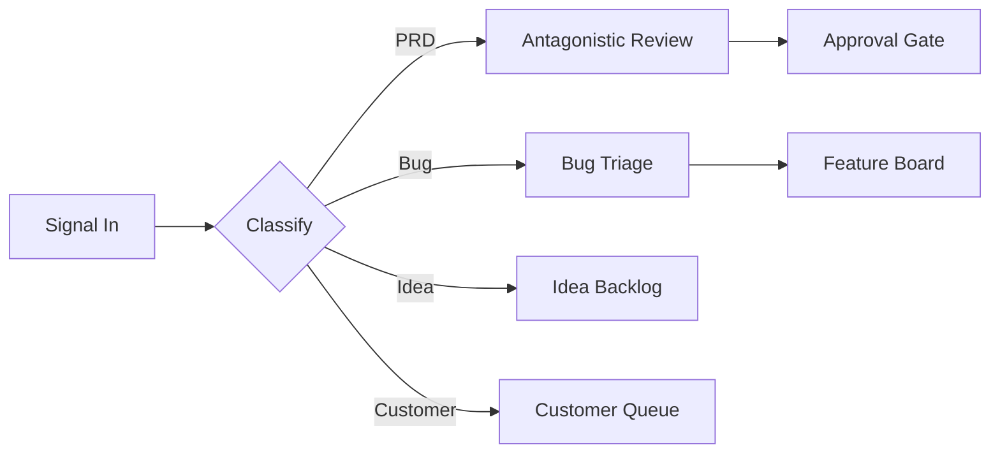
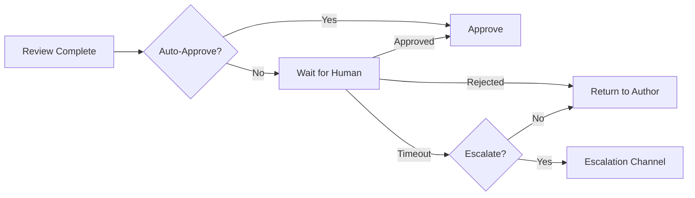
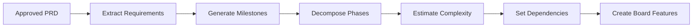
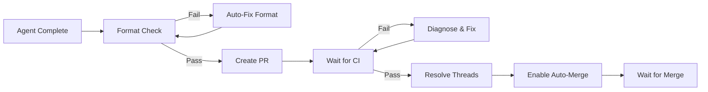
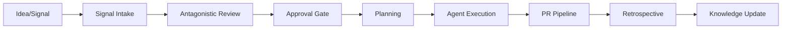

# Graph Flow Roadmap

> Architecture migration plan: deterministic LangGraph flows replacing dynamic agent execution.

## Status Overview

| Flow                      | Priority | Complexity    | Status   | PR       |
| ------------------------- | -------- | ------------- | -------- | -------- |
| Antagonistic Review       | -        | Medium        | **DONE** | #458-473 |
| Signal Intake             | HIGH     | Medium        | Planned  | -        |
| Approval Gate             | HIGH     | Small         | Planned  | -        |
| Planning (PRD → Features) | MEDIUM   | Large         | Planned  | -        |
| PR Pipeline               | MEDIUM   | Medium        | Planned  | -        |
| Retrospective             | LOW      | Medium        | Planned  | -        |
| Master Orchestrator       | LOW      | Architectural | Planned  | -        |

## Architecture Pattern

Every flow follows the same layered architecture established by the antagonistic-review reference implementation:

```
┌─────────────────────────────────────────────────┐
│  Claude Code Agents (via MCP tools)             │
├─────────────────────────────────────────────────┤
│  MCP Tool (packages/mcp-server/)                │
├─────────────────────────────────────────────────┤
│  Express API (apps/server/routes/flows/)        │
├─────────────────────────────────────────────────┤
│  Adapter (apps/server/services/*-adapter.ts)    │
├─────────────────────────────────────────────────┤
│  LangGraph Flow (libs/flows/src/*)              │
├─────────────────────────────────────────────────┤
│  LLM Providers (libs/llm-providers/)            │
│  Observability (libs/observability/ → Langfuse) │
└─────────────────────────────────────────────────┘
```

Each layer has a single responsibility:

- **LangGraph Flow** — Pure state machine. Nodes are functions, edges are conditional routing. No Express, no MCP, no side effects beyond LLM calls.
- **Adapter** — Translates between flow state and service interfaces. Handles Langfuse tracing setup, feature flag checks, backward-compatible event emission.
- **Express API** — HTTP endpoint for direct invocation. POST routes with `req.body` parameters (Express 5 convention).
- **MCP Tool** — Exposes the flow to Claude Code agents via the protoLabs plugin.

## Reference Implementation: Antagonistic Review

The antagonistic-review flow is the reference pattern. Key files:

```
libs/flows/src/antagonistic-review/
├── state.ts          # Annotation-based typed state
├── nodes/
│   ├── ava-review.ts       # Ava reviewer node
│   ├── jon-review.ts       # Jon reviewer node
│   └── consolidate.ts      # Review consolidation
├── graph.ts          # StateGraph definition + conditional edges
└── index.ts          # Public exports

apps/server/src/services/
├── antagonistic-review-adapter.ts   # Langfuse tracing + flow wrapping
└── antagonistic-review-service.ts   # Feature flag routing (graph vs legacy)

apps/server/src/routes/flows/
├── index.ts                         # Router factory
└── routes/
    ├── execute.ts                   # POST /api/flows/antagonistic-review
    └── resume.ts                    # POST /api/flows/antagonistic-review/resume (HITL)
```

Key patterns established:

- **Fan-out via `Send()`** — Parallel execution of reviewer nodes
- **Distillation depth routing** — Conditional edge selects shallow/medium/deep consolidation based on review agreement
- **Feature flag rollback** — `useGraphFlows` setting in `GlobalSettings` toggles between graph flow and legacy `DynamicAgentExecutor`
- **Lazy Langfuse init** — `ensureInitialized()` pattern avoids constructor async race conditions
- **Checkpointing** — Graph created with `createAntagonisticReviewGraph(true)` for HITL resume support

## Planned Flows

### 1. Signal Intake Flow

**Priority:** HIGH | **Complexity:** Medium | **Dependencies:** None

Route incoming signals (PRDs, bugs, ideas, customer requests) to the appropriate pipeline.



**Nodes:** classify, route, enrich (add context), validate (schema check)
**Replaces:** Manual signal routing logic (signal-router-service was removed in PR #673)
**Risk:** LOW — Deterministic classification is straightforward. LLM fallback for ambiguous signals.

### 2. Approval Gate Flow

**Priority:** HIGH | **Complexity:** Small | **Dependencies:** None

HITL approval with configurable timeout and escalation.



**Nodes:** check-auto-approve, wait-for-human (interrupt), apply-decision, escalate
**Replaces:** Manual Discord-based approval
**Risk:** LOW — Small scope, clear state transitions. Checkpointing required for interrupt/resume.

### 3. Planning Flow (PRD → Features)

**Priority:** MEDIUM | **Complexity:** Large | **Dependencies:** Antagonistic Review (done), Approval Gate

Decompose approved PRDs into milestones, phases, and board features.



**Nodes:** extract-requirements, generate-milestones, decompose-phases, estimate, set-deps, create-features
**Replaces:** `authority-agents/proj-m-agent.ts` (ProjM dynamic agent)
**Risk:** MEDIUM — LLM-heavy decomposition needs careful prompt engineering. Quality of output directly affects agent success rate downstream.

### 4. PR Pipeline Flow

**Priority:** MEDIUM | **Complexity:** Medium | **Dependencies:** None

Automated PR lifecycle from agent completion through merge.



**Nodes:** format-check, auto-fix, create-pr, wait-ci, diagnose-failure, resolve-threads, enable-merge
**Replaces:** PR Maintainer crew loop (partial) + manual post-flight workflow
**Risk:** MEDIUM — CI wait states need robust polling with backoff. Merge conflict resolution is hard to automate fully.

### 5. Retrospective Flow

**Priority:** LOW | **Complexity:** Medium | **Dependencies:** Planning Flow

Post-milestone reflection: what worked, what didn't, knowledge extraction.

**Nodes:** gather-data (commits, PRs, agent logs), analyze-patterns, extract-learnings, update-memory, generate-report
**Replaces:** `trigger_ceremony` manual invocation
**Risk:** LOW — Read-only analysis. No destructive operations.

### 6. Master Orchestrator Flow

**Priority:** LOW | **Complexity:** Architectural | **Dependencies:** All other flows

Top-level IDEA → SHIP composition. Chains all sub-flows into the full automation loop.



**Replaces:** Ava's manual orchestration loop
**Risk:** HIGH — Composition of flows requires robust error handling at each boundary. A failure in any sub-flow needs graceful degradation, not cascade failure.

## Migration Strategy

### Phase 1: Flow-as-Tool (Current)

Flows run alongside existing systems. Feature flags control routing.

- Graph flows exposed as MCP tools and API endpoints
- Legacy `DynamicAgentExecutor` path remains as fallback
- `useGraphFlows` setting toggles per-flow

### Phase 2: Flow-as-Default

After validation, flip defaults. Legacy code stays as emergency fallback.

- Default `useGraphFlows: true` for all migrated flows
- Monitor Langfuse traces for regression detection
- Per-flow feature flags for granular rollback

### Phase 3: Agent Replacement (Future)

Replace Claude Code deep agents with LangGraph ReAct agents using `@automaker/llm-providers`.

- ReAct agent nodes use `ChatAnthropic` from llm-providers
- Tool nodes wrap existing MCP tools as LangGraph tools
- Eliminates Claude Code SDK dependency for agent execution
- Full cost/token tracking via Langfuse at every node

**Risk assessment:** HIGH. This is a fundamental architecture change. Only attempt after Phase 2 is stable and well-instrumented.

## Success Metrics

| Metric           | Current (Dynamic Agents) | Target (Graph Flows)        |
| ---------------- | ------------------------ | --------------------------- |
| Cost per review  | ~$2.50 (Sonnet agent)    | ~$0.50 (targeted LLM calls) |
| Review latency   | 3-5 min                  | 30-60s                      |
| Observability    | Agent output logs only   | Per-node Langfuse traces    |
| Failure recovery | Manual retry             | Checkpoint resume           |
| Rollback time    | Code revert + deploy     | Feature flag toggle         |

## E2E Flow Coverage Map

Segments of the full IDEA → SHIP pipeline and their current implementation:

| Segment               | Current                       | Target                       | Status   |
| --------------------- | ----------------------------- | ---------------------------- | -------- |
| Signal classification | Escalation channels (PR #673) | Signal Intake Flow           | Partial  |
| PRD review            | `DynamicAgentExecutor`        | **Antagonistic Review Flow** | **DONE** |
| Approval              | Discord manual                | Approval Gate Flow           | Planned  |
| Decomposition         | `proj-m-agent.ts`             | Planning Flow                | Planned  |
| Agent execution       | `AgentService` + Claude SDK   | Keep as-is (Phase 3 future)  | N/A      |
| PR lifecycle          | PR Maintainer crew            | PR Pipeline Flow             | Planned  |
| Reflection            | `trigger_ceremony`            | Retrospective Flow           | Planned  |
| Full orchestration    | Ava manual loop               | Master Orchestrator Flow     | Planned  |
